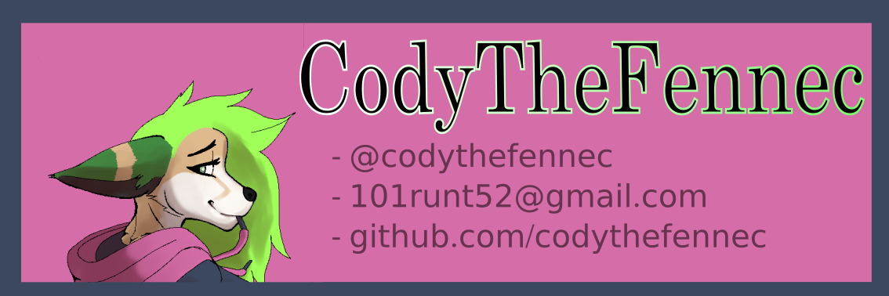

# Thanks for visiting my profile!
## About Me
My Pronouns are She / Her, I'm a computer science major at University Pacific (JUNIOR YEAR :DD)

I have a passion for video games and video game development even though I don't have the most time for it..

Working on getting cyber security certifications so I can enter the field professionaly!

Currently Looking Foward to: Cybersecurity Internships!!!
- 🔭 I’m currently working on a Poker Game using JavaFX
- 🌱 Currently learning penetration testing basics, and OWasp top 10 vulnerabilities
- 🤔 I’m looking for help with internship opportunities and marketing myself professionally
- 💬 Ask me about silly animals :3
- 📫 Where to find me? 
- - 101runt52@gmail.com
- - github.com/codythefennec (HERE)
- ⚡ Fun fact: Fennec foxes have very fluffy paws to prevent them from getting burnt on the hot sand!

<!--
**codythefennec/codythefennec** is a ✨ _special_ ✨ repository because its `README.md` (this file) appears on your GitHub profile.

Here are some ideas to get you started:
- 👯 I’m looking to collaborate on 

-->
